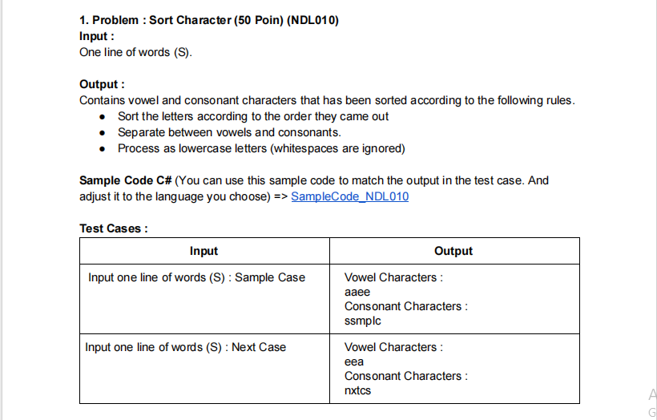

## Soal :
 

## Jawaban :
```javascript
const solution = (text) => {
    const textLower = text.toLowerCase().replace(' ', '')
    let textVowel = []
    let textConsonant = []
    for (let i = 0; i < textLower.length; i++) {
        if (textLower[i] === 'a' || textLower[i] === 'i' || textLower[i] === 'u' || textLower[i] === 'e' || textLower[i] === 'o' && textLower[i] !== ' ') {
            textVowel.push(textLower[i])
        } else {
            textConsonant.push(textLower[i])
        }
    }
    return `Vowel Characters: ${textVowel.sort((a, b) => a.localeCompare(b)).join('')} \nConsonant Characters: ${textConsonant.sort((a, b) => b.localeCompare(a)).join('')}`
}

const text = "Sample Case"
console.log(solution(text))
```