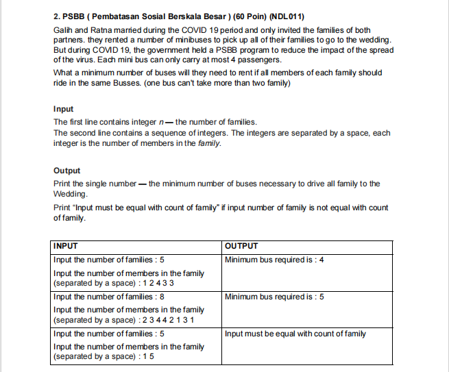

### Soal :
 

### Jawaban :
```javascript
const solution = (family, numberOfFamily) => {
    let numList = []
    let countBus = 0
    for (let i = 0; i < numberOfFamily.length; i++) {
        if (numberOfFamily[i] !== ' ') {
            numList.push(Number(numberOfFamily[i]))
        }
    }
    
    for (let i = 0; i < numList.length; i++) {
        if (numList[i] > 4) return "Input must be equal with count of family"
        countBus += numList[i]
    }
    countBus /= 4
    return Math.ceil(countBus)
}

const family = 5
const numberOfFamily = "1 5"
console.log(solution(family, numberOfFamily))
```