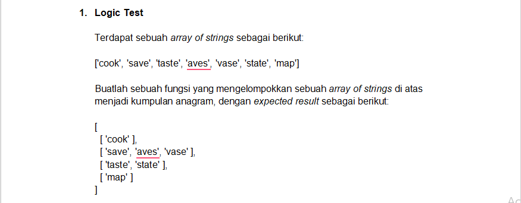

## Soal :


## Jawaban 1.
```javascript
const solution = (textArr) => {
    let group = []
    for (let i = 0; i < textArr.length; i++) {
        let isGrouped = false;
        const textSort = textArr[i].split('').sort().join('');

        for (let j = 0; j < group.length; j++) {
            const textSortGroup = group[j][0].split('').sort().join('');
        
            if (textSort === textSortGroup) {
                group[j].push(textArr[i])
                isGrouped = true
                break
            }
        }

        if (!isGrouped) {
            group.push([textArr[i]])
        }
    }
    return group
}
  
const x = ['cook', 'save', 'taste', 'aves', 'vase', 'state', 'map'];
console.log(solution(x));
```