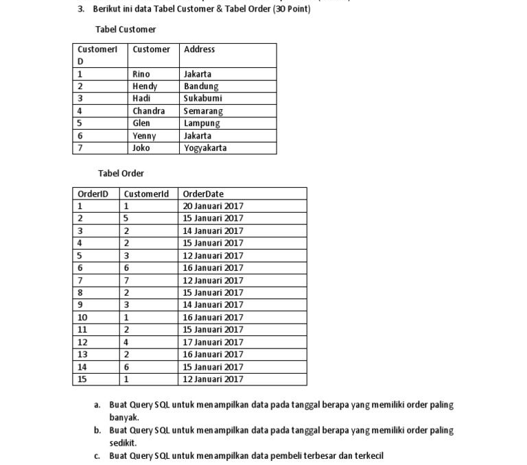

## Soal :


## Jawaban :
```javascript
const solution = (n) => {
    const result = [1]
    for (let i = 1; i <= n; i++) {
        if (i === 1) {
            result.push(1)
        } else {
            let next = result[i - 1] + result[i - 2]
            if (next > n) break
            result.push(next)
        }
    }
    return result
}

const n = 25
console.log(solution(n))
```

