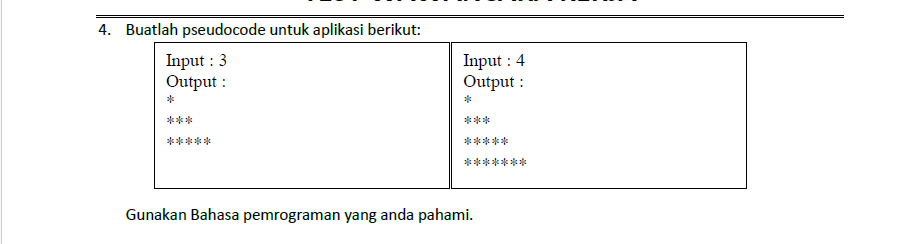

## Soal :


## Jawaban :
```javascript
const solution = (n) => {
    for (let i = 1; i <= n; i++) {
        let row = "";
        for (let j = 1; j <= 2 * i - 1; j++) {
            row += "*";
        }
        console.log(row);
    }
}

const n = 3
console.log(solution(n))
```

