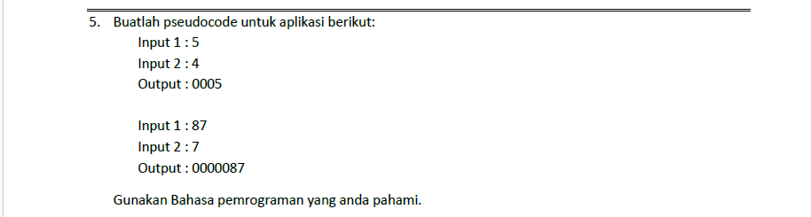

## Soal :


## Jawaban :
```javascript
const solution = (pattern, n) => {
    let stringPattern = String(pattern)
    let result = ''
    for (let i = 1; i <= n - stringPattern.length; i++) {
        result += 0
        if (i + stringPattern.length === n) {
            result += stringPattern
        }
    }
    return result
}

const pattern = 87
const n = 7
console.log(solution(pattern, n))
```