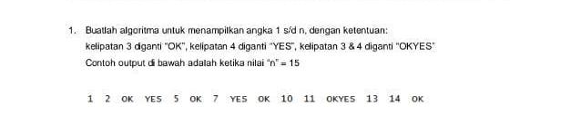

### Soal :

<p align="center">
  
</p>


### Jawaban :
```javascript
const solution = (n) => {
    for (let i = 0; i <= n; i++) {
        if (i % 3 === 0) {
            console.log('OK')
        }
        else if (i % 4 === 0) {
            console.log('YES')
        }
        else if (i % 4 === 0 && i % 3 === 0) {
            console.log('OKYES')
        }
        else {
            console.log(i)
        }
    }
}

const n = 15
solution(n)
```