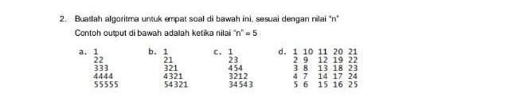

### Soal :
<p align="center">
  
</p>


### Jawaban a.
```javascript
const solution = (n) => {
    for (let i = 1; i <= n; i++) {
        let result = ''
        for (let j = 1; j <= i; j++) {
            result += i
        }
        console.log(result)
    }

}

const n = 5
solution(5)
```