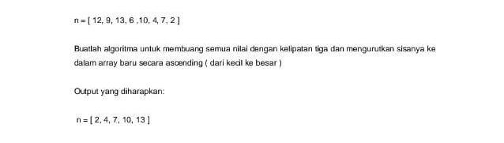

### Soal :
<p align="center">
  
</p>

### Jawaban :

```javascript
const solution = (n) => {
    let result = []
    for (let i = 0; i < n.length; i++) {
        console.log(n[i])
        if (n[i] % 3 !== 0) {
            console.log(n[i])
            result.push(n[i])
        }
    }
    return result.sort((a, b) => a - b )
}

const n = [12, 9, 13, 6, 10, 4, 7, 2]
console.log(solution(n))
```