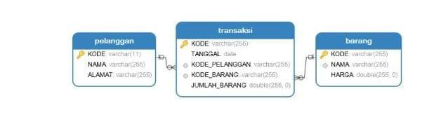
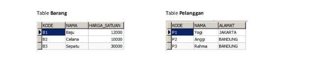
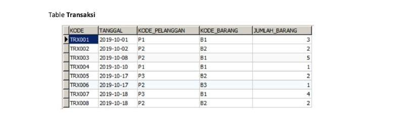
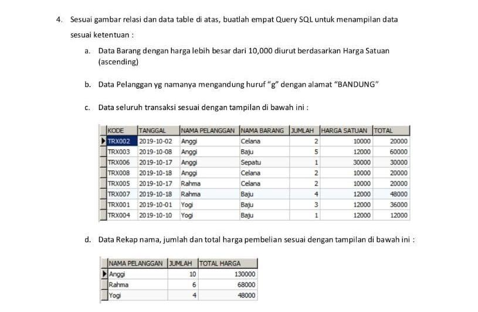

### Soal :

<p align="center">
  
  
  
  
</p>


### Jawaban a.
```sql
SELECT * FROM barang WHERE harga > 10000 ORDER BY harga ASC;
```

### Jawaban b.
```sql
SELECT * FROM pelanggan WHERE alamat = 'BANDUNG' AND nama LIKE '%g%';
```

### Jawaban c.
```sql
SELECT 
	t.kode AS kode, 
    t.tanggal AS tanggal, 
    p.nama AS `nama pelanggan`, 
    b.nama AS `nama barang`, 
    t.jumlah_barang AS jumlah, 
    b.harga AS `harga satuan`,
    (t.jumlah_barang * b.harga) AS total
FROM transaksi t 
LEFT JOIN pelanggan p ON t.kode_pelanggan = p.kode 
LEFT JOIN barang b ON t.kode_barang = b.kode
ORDER BY `nama pelanggan` ASC, t.tanggal ASC;
```

### Jawaban d.
```sql
SELECT 
    p.nama AS `nama pelanggan`, 
    SUM(t.jumlah_barang) AS jumlah, 
    SUM(t.jumlah_barang * b.harga) AS `total harga`
FROM transaksi t 
LEFT JOIN pelanggan p ON t.kode_pelanggan = p.kode 
LEFT JOIN barang b ON t.kode_barang = b.kode
GROUP BY `nama pelanggan`;
```